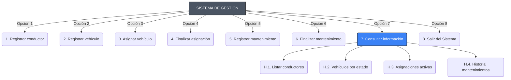

# Sistema de Gestión de Flota Vehicular

¡Bienvenido al **Sistema de Gestión de Flota Vehicular**! Esta aplicación es una solución basada en consola orientada a administrar las operaciones y el seguimiento de una flota de vehículos, junto con sus conductores, asignaciones temporales y procesos de mantenimiento.

## 📋 Flujo General del Sistema

El flujo recomendado para operar esta aplicación es secuencial, garantizando que todos los elementos existan y estén en regla:

1. **Registrar Entidades Base**:
   - Primero se debe registrar un **Conductor** (Opción 1).
   - Seguido, se debe registrar un **Vehículo** (Opción 2). Todo vehículo nuevo arranca su ciclo de vida en estado `DISPONIBLE`.
2. **Crear Asignaciones**:
   - Para que el vehículo circule, se **Asigna el vehículo a un conductor** (Opción 3).
   - El vehículo pasa al estado `EN_USO` y no podrá ser tomado por otro conductor, ni podrá entrar a mantenimiento rutinario hasta ser devuelto.
3. **Pausar/Finalizar Asignaciones**:
   - Al **Finalizar la asignación** (Opción 4), el vehículo es regresado y su estado vuelve de inmediato a `DISPONIBLE`.
4. **Registrar Mantenimientos**:
   - Un vehículo que sufra algún percance o que requiera un cambio de rutina preventivo puede ser llevado a los talleres mediante el **Registro de mantenimiento** (Opción 5).
   - En este punto, el vehículo cambia a estado `MANTENIMIENTO` y ningún conductor se lo podrá llevar.
5. **Retorno a Flota**:
   - Al **Finalizar el mantenimiento** (Opción 6), el vehículo vuelve a estar `DISPONIBLE` para ser asignado.
6. **Consultoria y Reportes**:
   - Usando la **Consulta de información** (Opción 7) puedes visualizar el histórico completo y tomar decisiones sobre la flota.

## ⚠️ Cosas a Tener en Cuenta

* **Almacenamiento en Memoria**: Actualmente, todos los datos (conductores, vehículos, histórico) se almacenan en la memoria RAM en tiempo de ejecución. **Al cerrar el programa y reabrirlo, los datos de la flota volverán a estar vacíos**.
* **Condiciones Limitantes**: No puedes dar de alta una asignación si el conductor o el vehículo no existen. Tampoco puedes sobreescribir mantenimientos u obligar a un conductor a usar un nuevo coche si el anterior no ha finalizado su respectiva asignación activa.
* **Formatos de Consola**: Cuando el sistema pida montos monetarios o kilómetros (datos tipo `double`), según la configuración de tu sistema operativo o consola, debes usar el punto `.` o la coma `,` para los decimales (esto varía directamente según el idioma del sistema donde corre Java).

## 🗺️ Diagrama del Menú Principal

Debajo está la representación gráfica del árbol del menú y de los submenús de navegación.

## 🚀 Tecnologías Utilizadas

- **Lenguaje**: Java 17+
- **Diseño**: Programación Orientada a Objetos (POO), Servicios (Separación de concepto).
- **Herramientas de Documentación**: Uso exclusivo de JavaDocs simulando JSDocs.
